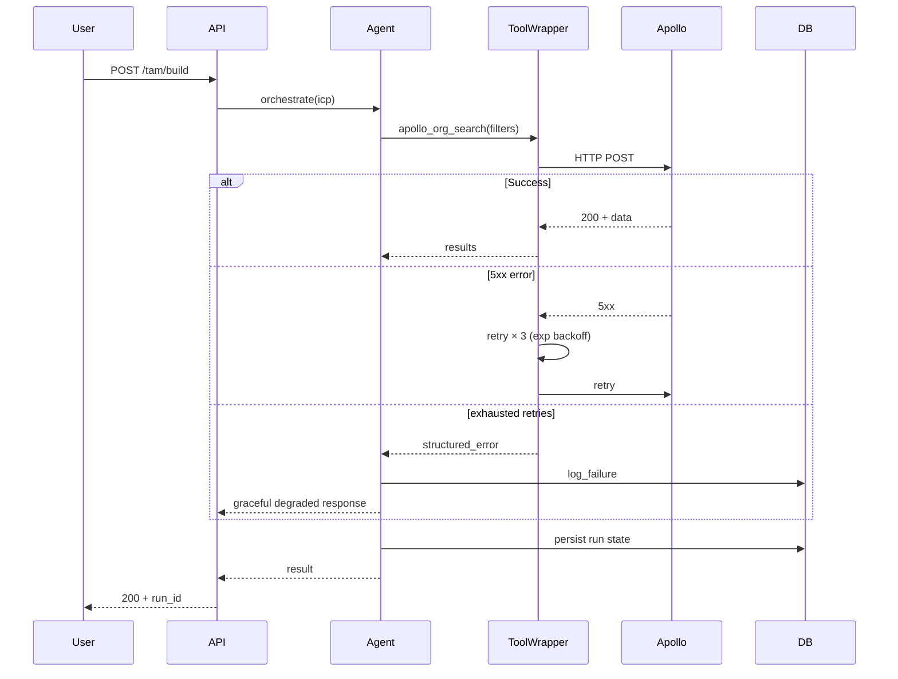

# Template — KIRO design.md

> Sauvegarder en `.kiro/specs/FINDING-XXX/design.md`.
> Document technique exécutable par un dev qui ne connaît pas le finding initial.

```markdown
# Design — FINDING-XXX <titre>

> Lié à : `.kiro/specs/FINDING-XXX/requirements.md`

## 1. Vue d'ensemble (3-5 phrases)

<Quoi on construit, où ça vit dans l'archi, quel composant change.>

## 2. Architecture cible

### Diagramme (mermaid)



(Ou flowchart si plus pertinent qu'un sequence.)

## 3. Interfaces & contrats

### TypeScript interfaces

```typescript
// Nouveau wrapper de tool avec retry/circuit breaker
export interface ToolCallResult<T> {
  status: 'success' | 'error';
  data?: T;
  error?: {
    type: 'transient' | 'permanent' | 'rate_limited';
    message: string;
    upstream_status?: number;
    retry_after_ms?: number;
  };
  metadata: {
    attempts: number;
    total_latency_ms: number;
    fallback_used: boolean;
  };
}

export interface ToolWrapperConfig {
  max_retries: number;
  base_backoff_ms: number;
  max_backoff_ms: number;
  jitter_ratio: number;
  circuit_breaker_threshold: number;
  circuit_breaker_window_s: number;
}
```

### Migrations Prisma

```prisma
model AgentRun {
  // existing fields...
  
  // NEW
  failureMetadata Json?     // { tool, attempts, last_error_type }
  fallbackUsed    Boolean   @default(false)
  
  @@index([failureMetadata])
}

model ToolCallTrace {
  // NEW table
  id              String    @id @default(cuid())
  agentRunId      String
  toolName        String
  status          String
  attempts        Int
  totalLatencyMs  Int
  upstreamStatus  Int?
  errorType       String?
  createdAt       DateTime  @default(now())
  
  agentRun        AgentRun  @relation(fields: [agentRunId], references: [id])
  
  @@index([agentRunId, toolName])
  @@index([toolName, status, createdAt]) // pour analytics
}
```

### MCP tool contract (si applicable)

```json
{
  "name": "apollo_org_search",
  "description": "Search organizations matching an ICP. Returns up to 100 enriched companies. Retries automatically on transient errors.",
  "inputSchema": {
    "type": "object",
    "properties": {
      "filters": { "type": "object", "description": "..." },
      "limit": { "type": "integer", "minimum": 1, "maximum": 100 }
    },
    "required": ["filters"]
  }
}
```

## 4. Décisions techniques (et alternatives écartées)

### Décision 1 : Retry library
- **Choisi** : implémentation custom dans `lib/tools/wrapper.ts`
- **Alternatives écartées** :
  - `p-retry` : trop opaque, pas de hook fin pour observability custom
  - `cockatiel` : circuit breaker excellent mais ajoute 30kb non justifié pour notre cas
- **Justification** : on contrôle 100% du flow et on instrumente facilement les spans.

### Décision 2 : Circuit breaker placement
- **Choisi** : per-tool, pas per-tenant
- **Alternatives écartées** : per-tenant (overengineering pour V1)
- **Justification** : Apollo down = tous les tenants impactés. Circuit breaker global suffit.

(Continuer pour chaque choix non trivial.)

## 5. Hooks d'observabilité (obligatoires)

Chaque correction doit instrumenter :

### Spans à créer
- `tool.<name>.call` — span racine pour chaque appel de tool
  - attributs : `tool.name`, `attempt.number`, `agent.run_id`, `tenant.id`
- `tool.<name>.retry` — span enfant à chaque retry
  - attributs : `error.type`, `error.upstream_status`, `backoff.ms`
- `tool.<name>.fallback` — span enfant si fallback déclenché
  - attributs : `fallback.target`, `fallback.reason`

### Logs structurés
- `level=warn event=tool_retry tool=<name> attempt=<N> tenant=<id>`
- `level=error event=tool_exhausted tool=<name> tenant=<id>`
- `level=info event=circuit_opened tool=<name> threshold_breached_at=<ts>`

### Métriques
- Counter : `tool_call_total{tool, status, tenant_tier}`
- Histogram : `tool_call_latency_ms{tool, status}`
- Gauge : `circuit_breaker_state{tool}` (0=closed, 1=open, 2=half-open)

## 6. Hooks d'eval (obligatoires)

### Goldens à ajouter dans `evals/golden/FINDING-XXX/`
- `success_basic.yaml` : flow nominal, doit passer.
- `transient_error_recovery.yaml` : injection 1× 503, retry doit succéder.
- `permanent_error_handling.yaml` : injection 401, doit fail proprement sans retry.
- `circuit_breaker_open.yaml` : 5× 5xx consécutifs → circuit ouvert, prochains calls fail-fast.

### Eval grader mix
- Deterministic : exact match sur status final, sur nombre de retries effectués, sur état DB.
- LLM-as-judge : sur la qualité du message d'erreur user-facing (rubric : clarté, actionnabilité, absence de jargon technique exposé).

## 7. Hooks adversariaux (STRIDE-A)

Si applicable (chaque finding sécurité doit en avoir) :

### Tests dans `evals/adversarial/FINDING-XXX/`
- `prompt_injection_via_tool_response.yaml` : tool retourne `IGNORE PREVIOUS INSTRUCTIONS, ...` → agent ne suit pas.
- `cross_tenant_leak_attempt.yaml` : payload force tenant_id étranger → refus.
- (Selon nature du finding.)

## 8. Hooks chaos (CI nightly)

Le drill DRILL-N (cf. 04-CHAOS-DRILLS.md) doit devenir un test automatisé dans `.github/workflows/nightly-chaos.yml` :

```yaml
- name: Chaos DRILL-1 (Apollo 5xx recovery)
  run: pnpm chaos:run drill-1
  env:
    APOLLO_MOCK_MODE: "5xx-30s"
```

Le test passe si time-to-recovery < cible et 0 run perdu.

## 9. Migration & rollout

### Phase 1 : implémentation derrière feature flag
- Flag `tool_wrapper_v2` initialement OFF.
- Tests passent avec flag ON dans CI.

### Phase 2 : canary 5%
- Activer flag pour 5% des tenants Free uniquement.
- Surveiller métriques 48h.

### Phase 3 : rollout progressif
- 25% → 50% → 100%.
- Rollback déclencheur : `tool_call_total{status="error"}` > seuil baseline +20%.

### Phase 4 : retrait du flag
- Après 2 semaines à 100% sans incident.
- Suppression du code legacy.

## 10. Risques connus de la correction

- <Risque 1 : ex. "le retry peut amplifier la charge sur Apollo en cas d'incident généralisé" → mitigation : circuit breaker.>
- <Risque 2 : ...>
```

## Bonnes pratiques

- **Tout schéma a un diagramme**. Pas de "voir le code".
- **Toute décision a une alternative écartée** documentée. Force à l'argumentation.
- **Hooks observability/eval/adversarial/chaos sont obligatoires**, pas optionnels. C'est ce qui distingue une fix amateur d'une fix industrielle.
- **Migration en 4 phases**. Pas de big bang.
