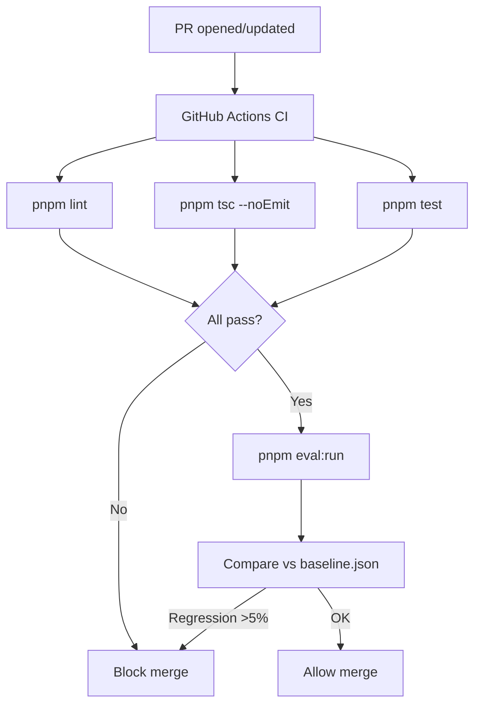

# Design — FINDING-001 CI/CD pipeline + eval gate

> Lie a : `.kiro/specs/FINDING-001/requirements.md`

## 1. Vue d'ensemble

Add a GitHub Actions CI workflow (.github/workflows/ci.yml) that runs on every PR to main. The workflow executes lint, typecheck, unit tests (vitest), and agent evals sequentially. Branch protection on main requires all checks to pass. A separate eval baseline mechanism compares current scores against stored baselines.

## 2. Architecture cible



## 3. Interfaces & contrats

### GitHub Actions workflow

```yaml
# .github/workflows/ci.yml
name: CI
on:
  pull_request:
    branches: [main]
  push:
    branches: [main]

jobs:
  quality:
    runs-on: ubuntu-latest
    steps:
      - uses: actions/checkout@v4
      - uses: pnpm/action-setup@v4
      - uses: actions/setup-node@v4
        with: { node-version: 22, cache: pnpm }
      - run: pnpm install --frozen-lockfile
      - run: pnpm lint
      - run: pnpm tsc
      - run: pnpm test
    
  eval:
    needs: quality
    runs-on: ubuntu-latest
    steps:
      - uses: actions/checkout@v4
      - uses: pnpm/action-setup@v4
      - uses: actions/setup-node@v4
        with: { node-version: 22, cache: pnpm }
      - run: pnpm install --frozen-lockfile
      - run: pnpm eval:run --baseline evals/baseline.json --threshold 0.05
        env:
          ANTHROPIC_API_KEY: ${{ secrets.ANTHROPIC_API_KEY }}
          DATABASE_URL: ${{ secrets.CI_DATABASE_URL }}
```

### Eval baseline schema

```typescript
interface EvalBaseline {
  generatedAt: string;
  scores: Record<string, {
    agent: string;
    score: number;
    passRate: number;
    caseCount: number;
  }>;
}
```

## 4. Decisions techniques

### Decision 1: GitHub Actions over Vercel checks
- Choisi: GitHub Actions
- Alternatives ecartees: Vercel build-time checks (limited to build, no custom eval steps)
- Justification: Full control over eval pipeline, secrets management, caching

### Decision 2: Eval runs in CI with real API keys
- Choisi: Real Anthropic API calls in CI
- Alternatives ecartees: Mocked evals (defeats the purpose), recorded responses (stale)
- Justification: Agent eval quality requires real model responses. Cost: ~$0.50/PR eval run.

## 5. Hooks d'observabilite

- GitHub Actions summary annotation with eval scores per agent
- PR comment with score table (agent, current, baseline, delta)
- Failed checks link to specific failing eval case

## 6. Hooks d'eval

### Baseline management
- `pnpm eval:baseline:update` regenerates evals/baseline.json from current run
- Baseline committed to repo, versioned with prompt changes
- PR that changes prompts MUST update baseline (enforced by CODEOWNERS review)

## 9. Migration & rollout

### Phase 1: Add workflow (no branch protection yet)
- CI runs but doesn't block. Monitor for flakiness.

### Phase 2: Enable branch protection
- After 1 week of stable CI, enable required checks on main.

### Phase 3: Add eval gate
- Add eval step after 2 weeks of stable quality checks.

## 10. Risques connus

- CI API key cost: ~$0.50/PR run. At 5 PRs/day = $75/month. Acceptable.
- Eval flakiness from LLM non-determinism: mitigate with deterministic graders first, llm_judge only where needed.
