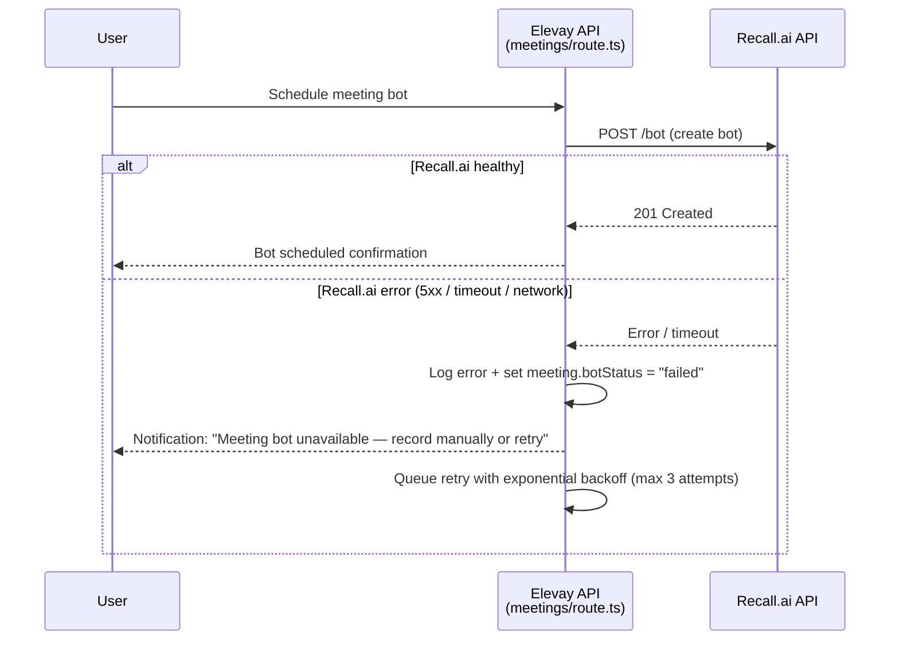
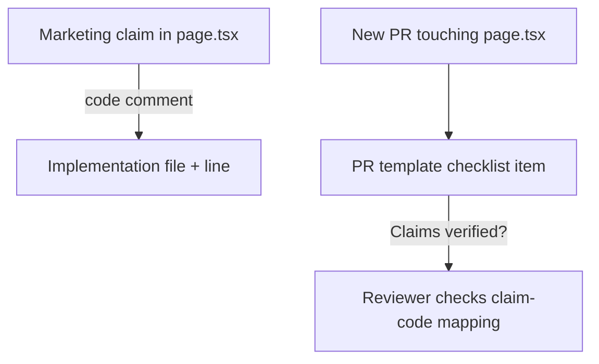

# Design — FINDING-002 Correct 3 overstated marketing claims

> Lie a : `.kiro/specs/FINDING-002/requirements.md`

## 1. Vue d'ensemble

Three categories of changes: (A) landing page copy corrections for CLAIM-001, CLAIM-003, CLAIM-013; (B) Recall.ai fallback error handling in the meeting bot scheduling path; (C) a lightweight claim-to-code traceability mechanism to prevent future drift.

## 2. Architecture cible

### 2a. Copy correction flow

```mermaid
flowchart LR
    subgraph Landing Page
      H1[Hero H1]
      TAG[Tagline]
      S02[Step 02]
      FOUND[Foundations card]
      FAQ[FAQ bot answer]
    end

    subgraph Code Reality
      RM[Recall.ai scheduler<br/>meetings/route.ts]
      AM[approval-mode.ts<br/>default: review-each]
      TH[threshold 1.1<br/>sequence-enrollment]
    end

    H1 -->|"joins your calls" → "connects to meetings via Recall.ai"| RM
    S02 -->|"auto-joins, records" → "joins via Recall.ai, records"| RM
    FOUND -->|"bot joins your calls" → "bot connects via Recall.ai"| RM
    FAQ -->|"automatically sends a bot" → "sends a Recall.ai bot"| RM
    TAG -->|"autonomous GTM" → "progressively autonomous"| AM
```

### 2b. Recall.ai fallback handling



### 2c. Claim traceability



## 3. Interfaces & contrats

### 3a. Landing page copy changes (page.tsx)

| Location | Current text | Revised text |
|----------|-------------|--------------|
| Hero H1 (line 361) | "joins your calls" | "connects to your meetings" |
| Hero subtitle (line 362) | "An AI bot joins your calls" | "A Recall.ai bot joins your meetings" |
| Tagline (line 360) | "The autonomous GTM engine for founders" | "The progressively autonomous GTM engine for founders" |
| Step 02 title (line 103) | "An AI bot joins your calls" | "A bot connects to your meetings" |
| Step 02 desc (line 104) | "Elevay auto-joins Google Meet..." | "Elevay connects a Recall.ai bot to your Google Meet..." |
| Foundations card (line 511) | "An AI bot joins your calls" | "A Recall.ai bot joins your meetings" |
| Foundations card body (line 511) | "A recording bot auto-joins..." | "A Recall.ai bot joins..." |
| FAQ answer (line 150) | "automatically sends a bot to join and record" | "automatically sends a Recall.ai bot to join and record" |

### 3b. Recall.ai fallback error shape

```typescript
// In meetings/route.ts or a shared recall-client.ts
interface RecallBotScheduleResult {
  success: boolean;
  botId?: string;
  error?: {
    code: "RECALL_UNAVAILABLE" | "RECALL_RATE_LIMITED" | "RECALL_AUTH_FAILED";
    message: string;
    retryAfterMs?: number;
  };
}
```

### 3c. Approval-mode comment enhancement

```typescript
// approval-mode.ts line 97 — existing code, enhanced comment
// Sequence enrollment is high-impact + hard to undo pre-WS-7.
// Threshold 1.1 = mathematically unreachable (confidence is 0-1).
// This is intentional: sequence enrollment ALWAYS requires human
// review until WS-7 (undo layer) ships and makes enrollment
// reversible. At that point, revisit this threshold.
// See: FINDING-002, .kiro/specs/FINDING-002/requirements.md AC-5.
"sequence-enrollment": 1.1,
```

## 4. Decisions techniques

### Decision 1: Attribution over abstraction in copy
- Choisi: Name Recall.ai explicitly in user-facing copy
- Alternatives ecartees: Keep vague "AI bot" phrasing (misleading), add a footnote (easy to miss)
- Justification: DD reviewers will search for "Recall" in code — finding it in marketing copy shows transparency. Users also benefit from knowing the specific integration.

### Decision 2: Fallback with retry, not silent skip
- Choisi: Notify user + retry with backoff (max 3 attempts)
- Alternatives ecartees: Silent retry only (user left wondering), immediate fail (bad UX)
- Justification: User must know when the bot will not join so they can record manually. Retry covers transient Recall.ai blips.

### Decision 3: "Progressively autonomous" over removing "autonomous"
- Choisi: Qualify the autonomy claim
- Alternatives ecartees: Remove "autonomous" entirely (loses differentiation), keep as-is (inaccurate)
- Justification: The product IS autonomous at high trust scores. The qualifier is accurate and preserves positioning. It matches the actual trust calibration flow (review-each -> batch-daily -> auto-high-confidence).

## 5. Hooks d'observabilite

- Log every Recall.ai bot scheduling failure with `{ event: "recall_bot_schedule_failed", meetingId, errorCode, attempt }` to existing agent traces
- Track fallback notification delivery to user

## 6. Hooks d'eval

- Snapshot test for landing page claim text — fails if someone reintroduces overstated wording without updating the snapshot
- Integration test: mock Recall.ai 500, verify user receives fallback notification within 5s

## 7. Risques connus

- Recall.ai might change their error response format — the fallback handler should be defensive (catch-all for non-2xx)
- "Progressively autonomous" is less punchy than "autonomous" — Martin may want to wordsmith further
- Naming Recall.ai in copy creates a marketing dependency — if Elevay switches providers, copy must update too
