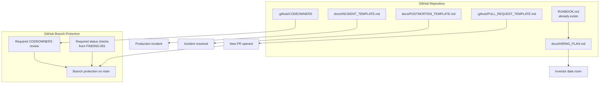
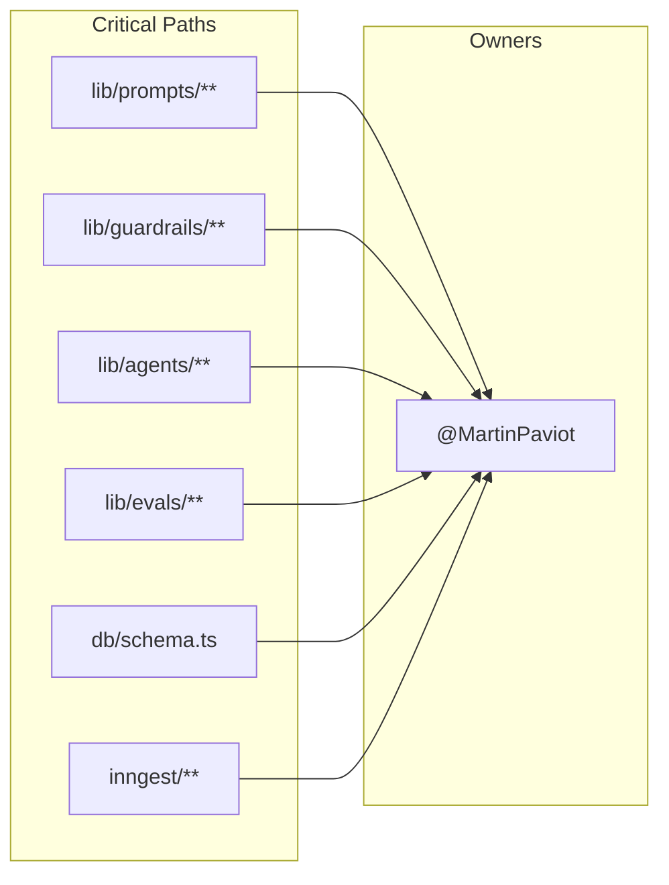
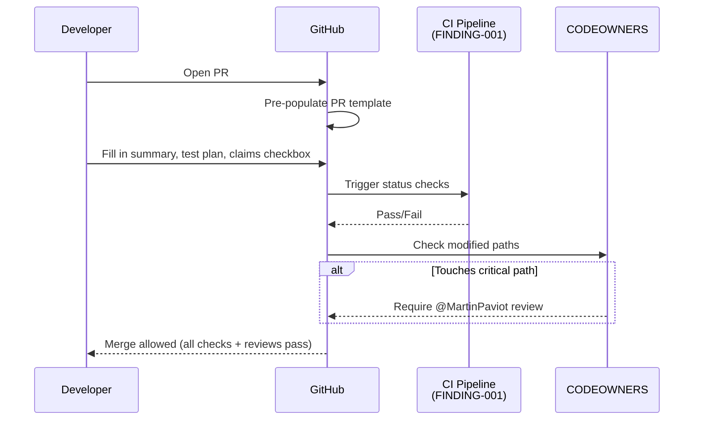

# Design — FINDING-003 Eliminate bus factor 1 via process scaffolding

> Lie a : `.kiro/specs/FINDING-003/requirements.md`

## 1. Vue d'ensemble

Add four process artifacts to the repository: CODEOWNERS, PR template, incident response template, and postmortem template. Additionally, create a hiring plan document suitable for the investor data room. None of these require code changes — they are process scaffolding that an investor expects to see.

## 2. Architecture cible

### 2a. Process artifact map



### 2b. CODEOWNERS coverage map



### 2c. PR lifecycle with template



## 3. Interfaces & contrats

### 3a. CODEOWNERS file

```
# .github/CODEOWNERS
# Require review for critical AI/agent paths.
# When engineer #2 joins, add them as co-owner.

# Agent prompts — any wording change can degrade agent quality
apps/web/src/lib/prompts/                @MartinPaviot

# Guardrails — approval mode, trust scoring, capability resolver
apps/web/src/lib/guardrails/             @MartinPaviot

# Agent registry and orchestration
apps/web/src/lib/agents/                 @MartinPaviot

# Eval framework — changes can mask regressions
apps/web/src/lib/evals/                  @MartinPaviot

# Database schema — migrations affect all tenants
apps/web/src/db/schema.ts                @MartinPaviot

# Background jobs — Inngest functions are production-critical
apps/web/src/inngest/                    @MartinPaviot

# Marketing claims — must match implementation (FINDING-002)
apps/web/src/app/(marketing)/page.tsx    @MartinPaviot
```

### 3b. PR template structure

```markdown
## Summary
<!-- 1-3 sentences: what and why -->

## Changes
<!-- Bulleted list of key changes -->

## Test plan
- [ ] Unit tests pass (`pnpm test`)
- [ ] Type check passes (`pnpm tsc`)
- [ ] Manual testing completed
- [ ] Marketing claims still match implementation (if touching marketing pages)

## Rollback plan
<!-- How to revert if this causes issues in production -->

## Related
<!-- Links to specs, findings, issues -->
```

### 3c. Incident response template structure

```markdown
# Incident: [TITLE]

**Severity**: P0 / P1 / P2
**Status**: Investigating / Mitigated / Resolved
**Start time**: YYYY-MM-DD HH:MM UTC
**End time**: YYYY-MM-DD HH:MM UTC
**Duration**: Xh Xm

## Impact
<!-- What users/features were affected and how -->

## Timeline
| Time (UTC) | Event |
|------------|-------|
| HH:MM | First alert / detection |
| HH:MM | Investigation started |
| HH:MM | Root cause identified |
| HH:MM | Mitigation applied |
| HH:MM | Incident resolved |

## Root cause
<!-- Technical description of what went wrong -->

## Remediation
<!-- What was done to fix it -->

## Follow-up actions
- [ ] Action item 1 — owner — due date
- [ ] Action item 2 — owner — due date
```

### 3d. Postmortem template structure

```markdown
# Postmortem: [INCIDENT TITLE]

**Incident ref**: [link to incident doc]
**Date**: YYYY-MM-DD
**Author**: [name]

## Summary
<!-- 2-3 sentences covering what happened and impact -->

## 5 Whys
1. Why did X happen? Because Y.
2. Why did Y happen? Because Z.
3. ...

## What went well
- 

## What went wrong
- 

## Action items
| Action | Owner | Due date | Status |
|--------|-------|----------|--------|
| | | | |

## Lessons learned
<!-- What will we do differently next time -->
```

## 4. Decisions techniques

### Decision 1: CODEOWNERS over manual review reminders
- Choisi: GitHub CODEOWNERS with branch protection enforcement
- Alternatives ecartees: Slack reminders (no enforcement), honor system (no enforcement)
- Justification: CODEOWNERS is the industry standard. It is enforced by GitHub — not bypassable without admin override. Every VC technical DD checks for this file.

### Decision 2: Single owner (Martin) for now, structured for expansion
- Choisi: All critical paths owned by @MartinPaviot, with comments indicating where engineer #2 slots in
- Alternatives ecartees: No CODEOWNERS until team >1 (misses the DD signal), bot account as placeholder (fake)
- Justification: A CODEOWNERS file with one owner still signals process maturity. The structure (comments, path grouping) shows the team knows how to scale it.

### Decision 3: Templates in repo over external wiki
- Choisi: All templates committed to the repository
- Alternatives ecartees: Notion wiki (not version-controlled), Google Docs (not discoverable by DD)
- Justification: DD reviewers clone the repo. Templates in `.github/` and `docs/` are immediately visible. Version control ensures templates evolve with the product.

### Decision 4: Hiring plan as markdown, not just a deck slide
- Choisi: `docs/HIRING_PLAN.md` in the repo
- Alternatives ecartees: Only in pitch deck (not technical enough), spreadsheet (not discoverable)
- Justification: Technical DD reviewers look at the repo. A hiring plan in markdown with specifics (role, timeline, onboarding checklist, architecture docs pointer) is more credible than a deck bullet point.

## 5. Hooks d'observabilite

Not applicable — these are process artifacts, not runtime code.

## 6. Hooks d'eval

- CI check: validate CODEOWNERS syntax (GitHub does this natively)
- CI check: validate PR template renders (manual verification on first PR after merge)

## 7. Risques connus

- CODEOWNERS with a single owner means Martin reviews his own PRs — this is expected for a solo founder and should be noted in the hiring plan as a known limitation resolved by hire #1
- Branch protection with required reviews may slow down Martin's solo velocity — acceptable tradeoff for DD optics. Martin can still merge after self-approving if branch protection allows admin bypass.
- Templates are only useful if followed — the hiring plan should mention that onboarding for engineer #2 includes a walkthrough of the PR process
