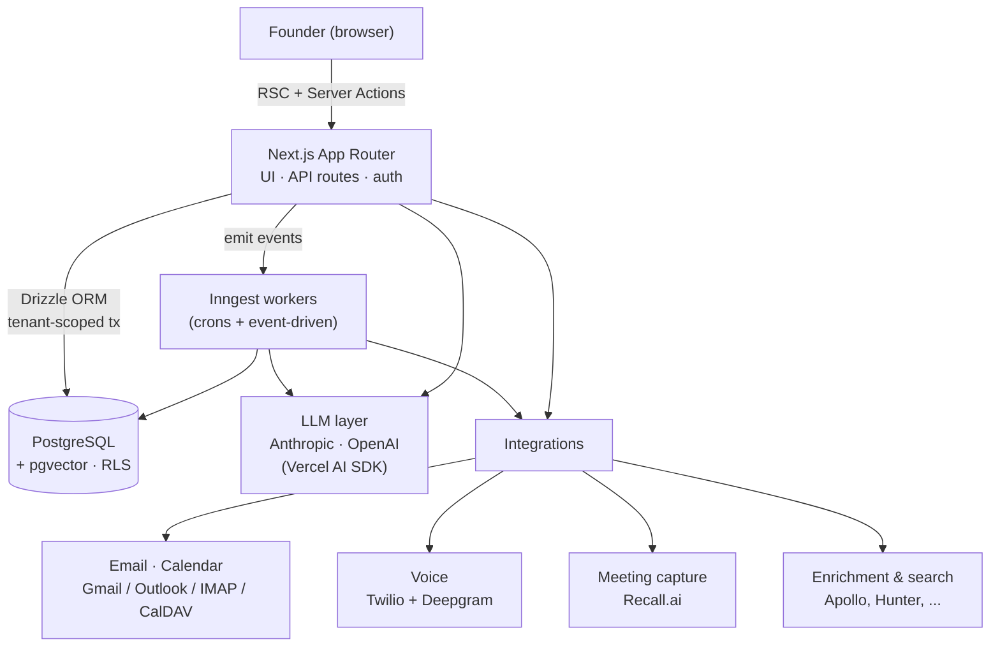

<div align="center">

# Elevay

**The pre-built revenue engine for founder-led sales.**

Elevay builds your target list, tells you who to reach and when, drafts your outreach across email and calls, and captures every meeting in your CRM — so a founder can run a full pipeline without an SDR team, manual data entry, or a stack of disconnected tools. You review and close; Elevay does the work around the conversation.

[](https://nextjs.org)
[](https://react.dev)
[](https://www.typescriptlang.org)
[](https://orm.drizzle.team)
[](https://vercel.com)
[](#license)

</div>

---

## Table of contents

- [Overview](#overview)
- [Capabilities](#capabilities)
- [Architecture](#architecture)
- [Notable systems](#notable-systems)
- [Tech stack](#tech-stack)
- [Repository layout](#repository-layout)
- [Getting started](#getting-started)
- [Scripts](#scripts)
- [Testing](#testing)
- [Data, privacy & security](#data-privacy--security)
- [Deployment](#deployment)
- [Conventions](#conventions)
- [License](#license)

---

## Overview

Most go-to-market tooling solves one slice and leaves the founder holding the rest. Legacy CRMs store what you sell but make you maintain them by hand. AI SDRs act autonomously under your name and spend your domain reputation. Tool stacks scatter prospecting, sequencing, and enrichment across products that forget what the others did.

Elevay is built to be none of those: **one system that builds the list, works the signals, drafts the outreach, captures every interaction, and remembers every conversation — and never acts without you.**

**Human in the loop is a first-class principle.** Elevay handles the research, list-building, first drafts, transcription, and follow-up reminders — the work that doesn't need a person. Every outbound email, deal change, and CRM write waits for the founder's approval. Autonomy is earned, configurable per action, and can be pulled back to drafts-only at any time (`copilot → guided → autonomous → strategic`).

**Who it's for:** early-stage founders running founder-led sales who need the back office they don't have yet.

> **Naming.** *Elevay* is the product and the brand used in every user-facing surface. `leadsens` / `@leadsens/*` is the internal monorepo and package namespace only.

---

## Capabilities

| Surface | What it does |
| --- | --- |
| **Up next** | The founder's morning briefing: KPIs, a cross-product activity feed (replies, opens, calls, deal moves), and a short "Needs you" queue of genuine human work. |
| **Accounts / TAM** | Describe your ICP once; Elevay searches live B2B databases, builds the target account list, scores every account against the ICP, and enriches decision-makers. Lifecycle stage is derived from real deal state. |
| **Contacts** | People under each account, scored for ICP-persona fit, with verified contact details and honest role-freshness (sourced titles are flagged, not asserted). |
| **Opportunities** | A pipeline board whose values, fields, and stages update from your calls and emails — the CRM fills itself. |
| **Call Mode** | A three-column cold-call cockpit: a queue prioritized by signals and local time, a pre-call brief (authority, why-now, relationship), live transcription, in-the-moment objection coaching, and one-tap post-call disposition that logs the outcome, deal, and follow-up tasks. Powered by Twilio + Deepgram. |
| **Campaigns** | Multi-touch email + call sequences drafted from each account's real signals and notes — nothing leaves your domain until you approve it. |
| **Inbox** | Per-user mailbox triage with prepared drafts; replies are detected and surfaced where they need a human. |
| **Meetings** | A recorder bot joins Google Meet / Zoom / Teams calls (via Recall.ai), transcribes them, and extracts notes, action items, and buying signals for review. |
| **Chat** | Ask your pipeline anything in plain language; answers stream back, each cited to the exact call, email, or knowledge entry it came from. |
| **Knowledge** | A workspace knowledge base organized by the moment in the sale that consumes it (sourcing, cold-call, outreach, objections, meetings), grounding the agent's drafting and answers. |

---

## Architecture

Elevay is a **pnpm + Turborepo monorepo**. The product is a single **Next.js (App Router)** application that owns the UI, the API, and the data layer, with **Inngest** running all background and scheduled work against the same Postgres database.



**Layers**

- **Web (`app/apps/web`)** — Next.js 15 App Router with three route groups: `(marketing)` (public landing + docs), `(dashboard)` (the authenticated product, ~70 pages), and `(legal)`. ~330+ API route handlers live under `app/api`. Auth is NextAuth (Auth.js) v5 with a Drizzle adapter, Google/Microsoft OAuth, and credentials.
- **Domain logic (`src/lib`)** — ~80 self-contained domains (scoring, ICP, enrichment, voice, campaign-engine, knowledge, accounts, collision, guardrails, …). UI components and routes stay thin; the logic is pure and unit-tested.
- **Data (`src/db`)** — Drizzle ORM over PostgreSQL with 80+ SQL migrations, full Row-Level Security for multi-tenant isolation, and pgvector for semantic retrieval. All tenant data access goes through a tenant-scoped transaction helper.
- **Background work (`src/inngest`)** — ~80 Inngest functions: enrichment, dossier building, signal monitoring, the autonomous pipeline, scoring-model training, win/loss analysis, deliverability, data retention, and the per-call coaching engine, among others.
- **AI** — the Vercel AI SDK (`ai`, `@ai-sdk/anthropic`, `@ai-sdk/openai`) plus provider SDKs, with EU-region routing and an optional Mistral-first sovereign router.

---

## Notable systems

Beyond the CRUD surface, Elevay runs a set of intelligence systems that make the pipeline self-maintaining:

- **Chat tool platform** — a large registry of typed tools (query, create, update, action, intelligence, memory, …) resolved **per turn** by a capability resolver that filters by role, surface, and feature flags, then narrowed further by an intent-based router so each request only sees the relevant tool groups. Destructive actions are gated and reversible.
- **Layered guardrails** — capability resolution (tool access) → approval mode (human-in-the-loop gating) → sending-identity enforcement (deliverability) → a progressive trust score that escalates autonomy only as it earns it.
- **Grounded retrieval** — full-text + pgvector hybrid search with rank fusion over a bi-temporal knowledge/context graph (entity extraction, resolution, edge invalidation with history preserved), so answers cite real calls, emails, and knowledge entries.
- **Forecasting & scoring** — ICP and buyer-intent scoring, a pure-math predictive scorer, Monte-Carlo revenue forecasting (p10/p50/p90), stall prediction, and post-close win/loss analysis.
- **Self-improving prompts** — low-scoring agent traces are clustered by failure pattern; targeted prompt patches are validated against golden cases and rolled out via canary with an eval gate before promotion.

---

## Tech stack

| Area | Technology |
| --- | --- |
| Framework | Next.js 15 (App Router, Turbopack), React 19 |
| Language | TypeScript 5.9 (strict) |
| Styling | Tailwind CSS v4, Framer Motion, lucide-react |
| Database | PostgreSQL + Drizzle ORM, pgvector, Row-Level Security |
| Auth | NextAuth / Auth.js v5 (Google + Microsoft OAuth, credentials) |
| Background jobs | Inngest (event-driven + cron) |
| AI | Vercel AI SDK v6, Anthropic, OpenAI (optional Mistral EU) |
| Voice | Twilio (Programmable Voice + Voice SDK), Deepgram (streaming STT) |
| Email & calendar | Resend, Nodemailer, ImapFlow, googleapis, tsdav / ical.js |
| Meeting capture | Recall.ai |
| Enrichment | Apollo, Hunter, Datagma, Firmable, Apify (LinkedIn role verification) |
| Billing | Stripe |
| Observability | Sentry, PostHog |
| Tooling | pnpm 10, Turborepo, Vitest, Playwright, ESLint |
| Hosting | Vercel (web) + Inngest Cloud |

---

## Repository layout

```
.
├── app/                       # pnpm + Turborepo monorepo (the product)
│   ├── apps/
│   │   ├── web/               # ← the Next.js application (primary)
│   │   │   ├── src/
│   │   │   │   ├── app/        # App Router: (marketing) · (dashboard) · api · auth
│   │   │   │   ├── components/ # shared React UI
│   │   │   │   ├── lib/        # ~80 domain modules (pure, tested)
│   │   │   │   ├── inngest/    # ~80 background & scheduled functions
│   │   │   │   ├── db/         # Drizzle schema + client + helpers
│   │   │   │   ├── hooks/      # React hooks
│   │   │   │   ├── auth.ts     # Auth.js configuration
│   │   │   │   └── middleware.ts
│   │   │   ├── drizzle/        # 80+ SQL migrations
│   │   │   ├── scripts/        # migration runner, voice stream bridge, ops
│   │   │   └── .env.example    # full environment reference
│   │   ├── worker/            # standalone worker app
│   │   └── admin/             # internal admin app
│   └── turbo.json
├── docs/                      # engineering & setup docs (e.g. voice bootstrap)
├── _specs/                    # Kiro-style feature specs (requirements/design/tasks)
├── _research/                 # competitive teardowns & raw research artifacts
├── _tools/                    # verification & automation scripts
└── README.md
```

> The `app/` directory is the product. The top-level `_*` directories hold the
> research, specs, and tooling used while building it.

---

## Getting started

### Prerequisites

- **Node.js 20+** (LTS)
- **pnpm 10.15.1** (pinned via `packageManager`) — `corepack enable` will provision it
- **PostgreSQL 15+** with the `pgvector` extension
- *(optional)* the [Inngest dev server](https://www.inngest.com/docs/local-development) for background jobs, and [ngrok](https://ngrok.com) for Twilio webhooks when working on Call Mode

### 1. Install

```bash
git clone https://github.com/MartinPaviot/leads.git
cd leads/app
pnpm install
```

### 2. Configure environment

```bash
cd apps/web
cp .env.example .env.local
```

Fill in `.env.local`. The essentials to boot the app:

| Group | Variables |
| --- | --- |
| Auth | `AUTH_SECRET`, `AUTH_URL`, `GOOGLE_CLIENT_ID/SECRET` (and/or Microsoft) |
| Database | `DATABASE_URL` |
| AI | `ANTHROPIC_API_KEY` and/or `OPENAI_API_KEY` |
| Email | `RESEND_API_KEY`, `INVITE_FROM_ADDRESS` |

Voice, enrichment, billing, and observability keys are optional and gate their
respective features (Call Mode, deep enrichment, paid plans, error reporting).
See `.env.example` for the fully documented list, including the EU-sovereignty
switches (`ANTHROPIC_REGION`, `GDPR_REGION`, `TWILIO_REGION`).

### 3. Set up the database

```bash
# from app/apps/web
pnpm db:migrate:apply   # applies the SQL migrations via the custom runner
```

> ⚠️ Use `db:migrate:apply`, **not** `db:migrate` — the latter is intentionally
> disabled because `drizzle-kit`'s journal diverges from the manual migration
> history. `db:generate` creates a new migration from the schema.

### 4. Run the app

```bash
# from app/apps/web
pnpm dev            # next dev --turbopack → http://localhost:3000

# in a second terminal, for background jobs:
npx inngest-cli@latest dev
```

Or run the whole monorepo from `app/` with `pnpm dev` (Turborepo).

---

## Scripts

Run from `app/apps/web`:

| Script | Description |
| --- | --- |
| `pnpm dev` | Start the dev server (Turbopack) |
| `pnpm build` / `pnpm start` | Production build / serve |
| `pnpm tsc` | Type-check (`tsc --noEmit`) |
| `pnpm lint` | ESLint (`next lint`) |
| `pnpm test` | Run the Vitest unit/integration suite |
| `pnpm e2e` | Run Playwright end-to-end tests (`e2e:install` first) |
| `pnpm eval:run` | Run the chat eval + golden-eval gate |
| `pnpm db:generate` | Generate a migration from the schema |
| `pnpm db:migrate:apply` | Apply migrations (custom runner) |
| `pnpm db:studio` | Open Drizzle Studio |
| `pnpm voice:stream` | Run the Twilio Media Streams ↔ Deepgram bridge (Call Mode) |

The monorepo root (`app/`) exposes the Turborepo passthroughs: `pnpm dev`, `build`, `lint`, `test`, `tsc`.

---

## Testing

The codebase ships with an extensive automated suite — **~390 test files** spanning unit tests for the `lib` domains, component tests, and Playwright end-to-end flows, plus an LLM eval harness for the chat and scoring surfaces.

```bash
cd app/apps/web
pnpm test          # Vitest
pnpm e2e:install   # one-time: install Playwright Chromium
pnpm e2e           # Playwright
pnpm eval:run      # LLM eval suite + golden-eval gate
```

> Run Vitest and `tsc` from `app/apps/web` (the repo root carries a second
> Vitest config where the `@/` alias does not resolve).

---

## Data, privacy & security

Selling on behalf of a founder means handling their inbox, calendar, calls, and pipeline — so the data posture is part of the product, not an afterthought.

- **Multi-tenant isolation.** Every tenant row is protected by PostgreSQL Row-Level Security; all data access flows through a tenant-scoped transaction so one workspace can never read another's data.
- **OAuth, never passwords.** Mail and calendar are connected over OAuth (Google / Microsoft); tokens are stored per user and access can be revoked at any time.
- **Encryption.** Data is encrypted in transit and at rest; sensitive credentials and tenant settings are encrypted at the application layer (`ELEVAY_APP_SECRET`).
- **EU sovereignty (opt-in).** LLM calls can be pinned to `eu.anthropic.com` (or a Mistral-first EU router), Postgres can be required to resolve to an EU/CH host, Twilio media can be pinned to Dublin (`ie1`), and Sentry to its Frankfurt region — configured entirely through environment variables.
- **GDPR endpoints.** First-class data export and deletion (`/api/gdpr/export`, `/api/gdpr/delete`).
- **Hardening.** Signed (HMAC) audit trail, per-tenant rate limiting, SSRF-guarded outbound fetches, and strict security headers.
- **Human-in-the-loop guardrails.** Per-action autonomy levels, send windows, daily caps, and a do-not-contact list gate every outbound action.

---

## Deployment

The web app deploys to **Vercel** with the project root set to `app/apps/web`. Pushing to `main` auto-deploys to production (`www.elevay.dev`). Background functions run on **Inngest Cloud**, registered via the app's Inngest route. Database migrations are applied out-of-band with `pnpm db:migrate:apply` against the production `DATABASE_URL`.

---

## Conventions

A few load-bearing rules enforced across the codebase (see `CLAUDE.md` for the full set):

- **No emoji in product UI** — use `lucide-react` icons; this is enforced by tests.
- **Brand is Elevay** in every user-facing string; provider names (Apollo, Lusha, …) are never shown to users ("sourced by Elevay").
- **Tenant scoping is mandatory** — never query tenant data outside the tenant-scoped transaction helper.
- **Every feature ships with tests**, and every fixed bug gets a regression test.

---

## License

Proprietary — © 2026 Elevay. All rights reserved. The source is published for reference only; it is not licensed for reuse, redistribution, or modification.
