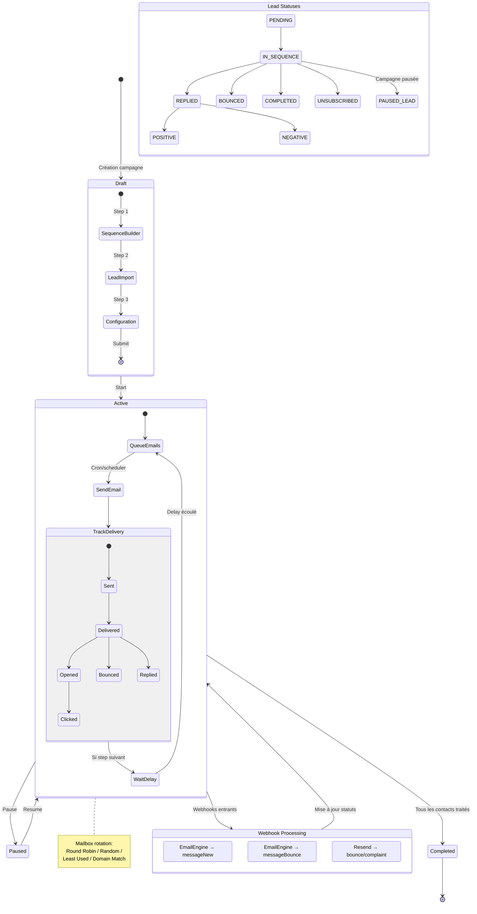
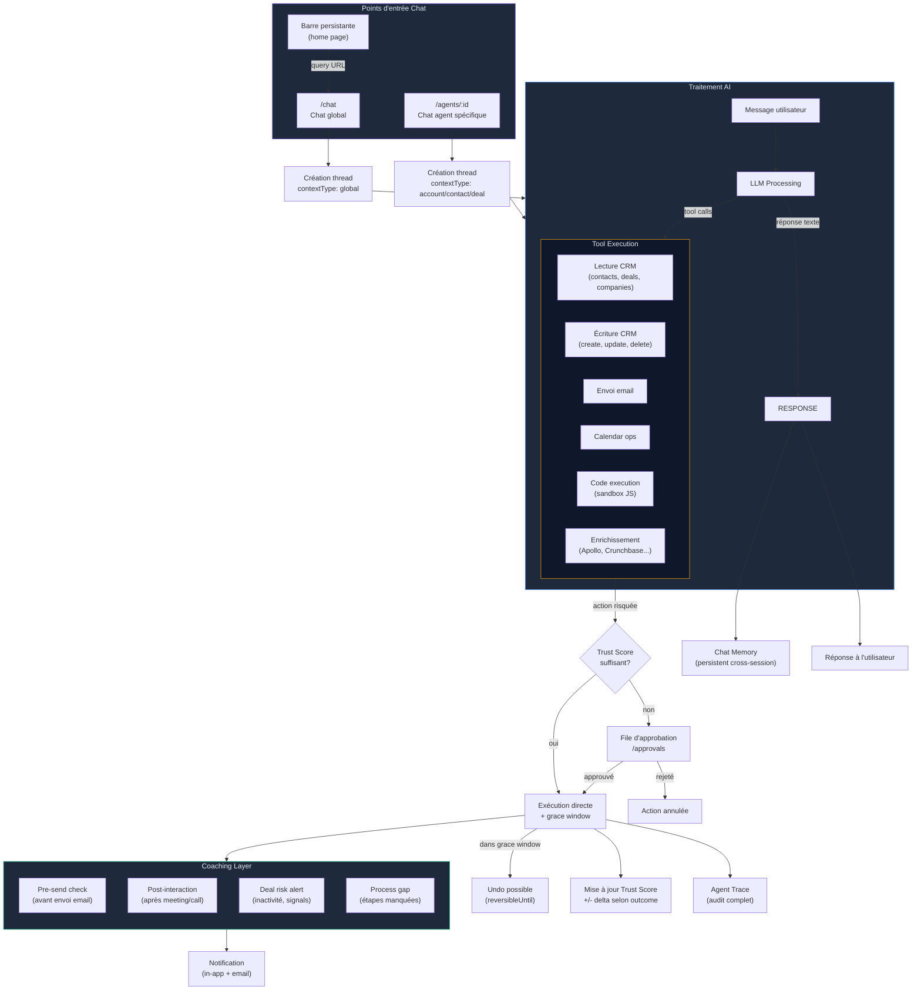
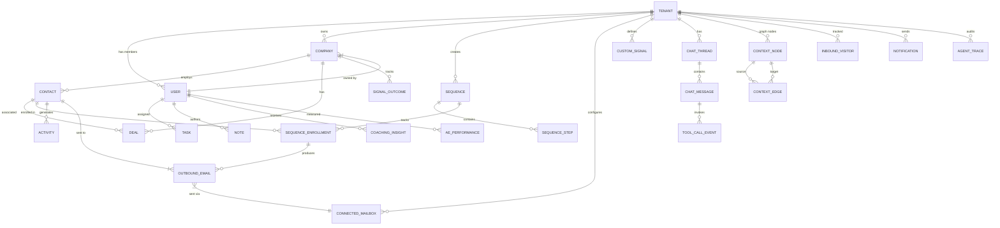
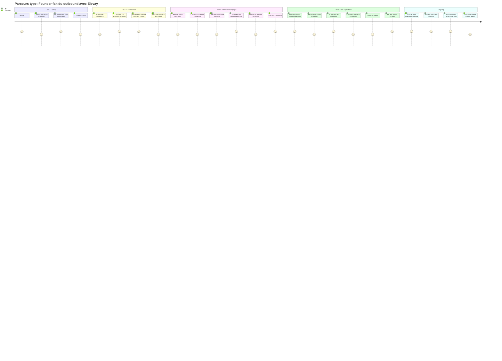

# Elevay - User Flow Diagram

## Vue d'ensemble

```mermaid
flowchart TB
    START((Visiteur)) --> AUTH

    subgraph AUTH["Authentication"]
        LOGIN["/login"] --> |credentials| SESSION
        SIGNUP["/signup"] --> |register| SESSION
        SESSION{Session active?}
        SESSION --> |non| LOGIN
    end

    SESSION --> |oui, onboarding incomplet| ONBOARDING
    SESSION --> |oui, onboarding terminé| DASHBOARD

    subgraph ONBOARDING["Onboarding Wizard (7 étapes)"]
        direction TB
        O1["1. Welcome\nNom, entreprise, site web, rôle"] --> O2
        O2["2. Connect\nGoogle OAuth / Microsoft OAuth\n(ou skip)"] --> O3
        O3["3. Privacy\nSync settings, backsync range,\ndomaines exclus"] --> O4
        O4["4. Product\nDescription produit, sales motion,\nbiggest challenge, tone"] --> O5
        O5["5. ICP\nIndustries, tailles, géographies,\nseniority, département\n+ TAM estimate live"] --> O6
        O6["6. Building\nRecherche companies → validation →\nenrichissement → scoring → signaux\n(stream NDJSON temps réel)"] --> O7
        O7["7. Ready\nStats: companies, contacts, ICP matches\nQuick wins + liens rapides"]
    end

    O7 --> DASHBOARD

    subgraph DASHBOARD["Dashboard Principal"]
        direction TB
        HOME["/home\nVue d'ensemble workspace"]
        SIDEBAR["Sidebar Navigation"]
    end

    SIDEBAR --> NAV_AGENTS
    SIDEBAR --> NAV_STORE
    SIDEBAR --> NAV_CHAT
    SIDEBAR --> NAV_MISSIONS
    SIDEBAR --> NAV_APPROVALS
    SIDEBAR --> NAV_DNA
    SIDEBAR --> NAV_CONNECTIONS
    SIDEBAR --> NAV_SETTINGS

    subgraph NAV_AGENTS["Agents"]
        direction TB
        AGENTS_LIST["/agents\nListe des agents"] --> AGENT_NEW
        AGENTS_LIST --> AGENT_DETAIL
        AGENT_NEW["/agents/new\nCréation par prompt AI\n+ suggestions rapides"]
        AGENT_BUILD["/agents/build\nBuilder chat avancé"]
        AGENT_DETAIL["/agents/:id\nChat avec l'agent"]
        AGENT_DETAIL --> AGENT_ANALYTICS
        AGENT_DETAIL --> AGENT_BRIEF
        AGENT_DETAIL --> AGENT_CAMPAIGNS
        AGENT_DETAIL --> AGENT_FLOW
        AGENT_DETAIL --> AGENT_IMPROVEMENTS
        AGENT_DETAIL --> AGENT_INBOX
        AGENT_ANALYTICS["/agents/:id/analytics\nMétriques performance"]
        AGENT_BRIEF["/agents/:id/brief\nConfiguration mission"]
        AGENT_FLOW["/agents/:id/flow\nEditeur workflow visuel"]
        AGENT_IMPROVEMENTS["/agents/:id/improvements\nSuggestions d'optimisation"]
        AGENT_INBOX["/agents/:id/inbox\nMessages/notifications"]
    end

    subgraph CAMPAIGNS["Campaigns (sous Agent)"]
        direction TB
        AGENT_CAMPAIGNS["/agents/:id/campaigns\nListe campagnes"] --> CAMP_NEW
        AGENT_CAMPAIGNS --> CAMP_DETAIL
        CAMP_NEW["/agents/:id/campaigns/new\n3 étapes: Séquence → Leads → Config"]
        CAMP_DETAIL["/agents/:id/campaigns/:cid\n4 onglets"]
        CAMP_DETAIL --> CAMP_LEADS["Leads\nStatut, étape, sentiment"]
        CAMP_DETAIL --> CAMP_SEQ["Séquence\nTimeline + stats par étape"]
        CAMP_DETAIL --> CAMP_ANALYTICS["Analytics\nPerformance quotidienne"]
        CAMP_DETAIL --> CAMP_AB["A/B Test\nComparaison variants"]
    end

    subgraph CAMP_CREATION["Création Campaign (3 étapes)"]
        direction TB
        CC1["1. Sequence Builder\nNom, preset (Classic/Aggressive/Soft)\nÉtapes email + wait\nA/B testing par étape"] --> CC2
        CC2["2. Lead Import\nUpload CSV, mapping colonnes auto,\npréview table"] --> CC3
        CC3["3. Configuration\nTimezone, jours, heures,\nlimite envoi, stratégie mailbox"]
    end

    CAMP_NEW --> CC1

    subgraph CAMP_WIZARD["Campaign Wizard (modal)"]
        direction TB
        CW1["1. Targets\nIndustries, tailles, rôles,\nmax companies, min score"] --> CW2
        CW2["2. Building\nCréation → Génération steps →\nPréparation → Enrichissement →\nContacts → Emails"] --> CW3
        CW3["3. Review\nListe emails draft/approved\nApprove all"] --> CW4
        CW4["4. Launch\nRésumé + lancement\nEmails queued"]
    end

    subgraph NAV_STORE["Store / My Team"]
        direction TB
        STORE["/store\nBrowse agent templates\nFiltre par catégorie"] --> STORE_PREVIEW
        STORE_PREVIEW["Preview Dialog\nDescription, triggers,\napps utilisées"] --> STORE_SETUP
        STORE_SETUP["Setup Wizard\nWelcome → Connect OAuth → Ready"]
    end

    subgraph NAV_CHAT["Chat Global"]
        direction TB
        CHAT["/chat\nInterface multi-agent"] --> CHAT_CONV["/chat/:conversationId\nConversation individuelle"]
        PERSISTENT_BAR["Barre chat persistante\n(visible sur home)"] --> |query| CHAT
    end

    subgraph NAV_MISSIONS["Missions"]
        direction TB
        MISSIONS["/missions\nHistorique exécutions agents\nSource: Schedule/Webhook/Chat/Manual"] --> MISSION_DETAIL
        MISSION_DETAIL["/agents/:id/chat/:convId\nDétail conversation"]
    end

    subgraph NAV_APPROVALS["Approvals"]
        APPROVALS["/approvals\nFile d'attente actions agent\nApprouver / Rejeter\n(refresh 10s)"]
    end

    subgraph NAV_DNA["Company DNA"]
        DNA["/dna\nProfil entreprise\nGénérer depuis site web\nou saisie manuelle"]
    end

    subgraph NAV_CONNECTIONS["Connections"]
        direction TB
        INTEGRATIONS["/integrations\nGoogle Workspace, Microsoft 365,\nSlack, Notion"] --> INT_CONNECT
        INT_CONNECT["OAuth via Composio\nConnect / Disconnect"]
        CREDENTIALS["/credentials\nGestion des credentials"]
    end

    subgraph NAV_SETTINGS["Settings"]
        direction TB
        SET_GENERAL["/settings\nProfil, mot de passe, 2FA, thème"]
        SET_BILLING["/settings/billing"]
        SET_MAILBOXES["/settings/mailboxes\nMailboxes d'envoi"]
        SET_MEMBERS["/settings/members\nÉquipe + invitations"]
        SET_WORKSPACE["/settings/workspace"]
        SET_SECURITY["/settings/security"]
        SET_NOTIFICATIONS["/settings/notifications"]
        SET_COMPLIANCE["/settings/compliance"]
        SET_TEAMS["/settings/teams"]
        SET_PHONE["/settings/phone"]
        SET_COMPUTERS["/settings/computers"]
        SET_SPEECH["/settings/speech"]
        SET_CONNECTIONS["/settings/connections"]
    end

    subgraph SHARED["Partage"]
        SHARED_LINK["/shared/:token\nAgent public (embed/demo)"]
    end

    style AUTH fill:#1e293b,stroke:#3b82f6,color:#e2e8f0
    style ONBOARDING fill:#1e293b,stroke:#8b5cf6,color:#e2e8f0
    style DASHBOARD fill:#1e293b,stroke:#10b981,color:#e2e8f0
    style NAV_AGENTS fill:#1e293b,stroke:#f59e0b,color:#e2e8f0
    style CAMPAIGNS fill:#1e293b,stroke:#f59e0b,color:#e2e8f0
    style CAMP_CREATION fill:#1e293b,stroke:#f97316,color:#e2e8f0
    style CAMP_WIZARD fill:#1e293b,stroke:#f97316,color:#e2e8f0
    style NAV_STORE fill:#1e293b,stroke:#06b6d4,color:#e2e8f0
    style NAV_CHAT fill:#1e293b,stroke:#ec4899,color:#e2e8f0
    style NAV_MISSIONS fill:#1e293b,stroke:#84cc16,color:#e2e8f0
    style NAV_APPROVALS fill:#1e293b,stroke:#ef4444,color:#e2e8f0
    style NAV_DNA fill:#1e293b,stroke:#a855f7,color:#e2e8f0
    style NAV_CONNECTIONS fill:#1e293b,stroke:#14b8a6,color:#e2e8f0
    style NAV_SETTINGS fill:#1e293b,stroke:#6b7280,color:#e2e8f0
    style SHARED fill:#1e293b,stroke:#6366f1,color:#e2e8f0
```

## Flow Détaillé: Onboarding → Premier Usage

```mermaid
sequenceDiagram
    participant U as Utilisateur
    participant APP as Elevay App
    participant AI as AI Backend
    participant API as APIs externes
    participant DB as Database

    Note over U,DB: SIGNUP & ONBOARDING
    U->>APP: Signup (email/password)
    APP->>DB: Crée user + tenant
    APP->>U: Redirect → Onboarding Wizard

    rect rgb(30, 41, 59)
    Note over U,AI: Step 1 - Welcome
    U->>APP: Nom, entreprise, site web, rôle
    APP->>AI: POST /api/onboarding/analyze-website
    APP->>API: POST /api/onboarding/enrich-icp (Apollo)
    APP->>AI: POST /api/onboarding/narrate-website (SSE stream)
    AI-->>APP: Analyse produit + tone + ICP suggestions
    end

    rect rgb(30, 41, 59)
    Note over U,API: Step 2 - Connect
    U->>APP: Click "Connect Google" ou "Connect Microsoft"
    APP->>API: OAuth flow (Google/Microsoft)
    API-->>APP: Tokens OAuth
    APP->>DB: Sauvegarde connexion email
    end

    rect rgb(30, 41, 59)
    Note over U,DB: Step 3 - Privacy
    U->>APP: Paramètres sync (selective/always/disabled)
    U->>APP: Backsync range (1-12 mois)
    U->>APP: Domaines exclus
    APP->>DB: POST /api/onboarding/save
    end

    rect rgb(30, 41, 59)
    Note over U,AI: Step 4 - Product
    U->>APP: Description produit, sales motion, challenge
    AI-->>APP: Narrative streamée (du step 1)
    APP->>U: Confirmation tone suggéré
    end

    rect rgb(30, 41, 59)
    Note over U,API: Step 5 - ICP
    U->>APP: Industries, tailles, géographies, seniority
    APP->>API: POST /api/tam/estimate (debounced 400ms)
    API-->>APP: "≈ 12,400 companies"
    APP->>U: TAM estimate live + confidence gaps
    end

    rect rgb(30, 41, 59)
    Note over U,DB: Step 6 - Building (NDJSON Stream)
    APP->>AI: POST /api/tam/build (targetCount=200)
    loop Stream NDJSON
        AI-->>APP: hello → strategy.generated
        AI-->>APP: search.progress (page par page)
        AI-->>APP: company.inserted (avec score + signaux)
        AI-->>APP: signal.computed (investor_overlap, funding, hiring...)
        AI-->>APP: contacts.found
        AI-->>APP: warm_path.computed
        AI-->>APP: done (summary)
    end
    APP->>U: Top 5 companies preview en temps réel
    APP->>DB: 200 companies + contacts insérés
    end

    rect rgb(30, 41, 59)
    Note over U,APP: Step 7 - Ready
    APP->>U: Stats finales + quick wins
    U->>APP: "Go to your engine"
    APP->>U: Redirect → /home
    end

    Note over U,DB: PREMIER USAGE
    U->>APP: Explore dashboard
    U->>APP: Browse /agents ou /store
    U->>APP: Crée premier agent ou lance campagne
```

## Flow Détaillé: Cycle de Vie d'une Campagne

## Flow Détaillé: Chat AI & Agent Actions

## Flow Détaillé: Scoring & Signaux

```mermaid
flowchart LR
    subgraph SOURCES["Sources de données"]
        APOLLO["Apollo API"]
        CRUNCHBASE["Crunchbase"]
        HUNTER["Hunter.io"]
        WEB["Web scraping"]
        INBOX["Inbox analysis"]
    end

    subgraph SIGNALS["Signal Detectors (5 built-in)"]
        S1["investor_overlap\nInvestisseurs communs"]
        S2["funding_recent\nLevée de fonds récente"]
        S3["funding_crunchbase\nDonnées Crunchbase"]
        S4["hiring_intent\nRecrutement actif"]
        S5["yc_company\nPortfolio Y Combinator"]
    end

    subgraph CUSTOM["Custom Signals"]
        CS["Signaux définis par l'utilisateur\njudgePrompt + keywords + urlPatterns"]
    end

    SOURCES --> SIGNALS
    SOURCES --> CUSTOM

    subgraph SCORING["Scoring Engine"]
        BASE["Base Fit Score\n0-100 (ICP match)"]
        BONUS["Signal Bonus\n+5pts x multiplier par signal\n(cap +20 total)"]
        FINAL["Score Final\n= base + bonus"]
        GRADE["Grade\nA (80+) / B (60+) / C (40+) / D"]
        HEAT["Heat Level\nhot / warm / cold"]
    end

    SIGNALS --> BONUS
    CUSTOM --> BONUS
    BASE --> FINAL
    BONUS --> FINAL
    FINAL --> GRADE
    FINAL --> HEAT

    subgraph DISPLAY["Affichage"]
        CHIP_GREEN["Signal Chip vert\nConfirmé (value=true)"]
        CHIP_GREY["Signal Chip gris\nAbsent (value=false)"]
        CHIP_SHIMMER["Signal Chip shimmer\nEn cours (payload=null)"]
        CHIP_DASHED["Signal Chip tirets\nMoyenne confiance (heuristic)"]
        POPOVER["Popover détail\nReasoning + Sources\n(verified / unverified)"]
    end

    GRADE --> DISPLAY
    SIGNALS --> DISPLAY
    CUSTOM --> DISPLAY

    subgraph ATTRIBUTION["Attribution (flywheel)"]
        OUTCOME["Deal won/lost"]
        SIGNAL_OUTCOME["Signal Outcome\n(quel signal a prédit)"]
        LIFT["Lift Multiplier\n(cross-tenant benchmark)"]
        RETRAIN["Ajustement scoring model"]
    end

    OUTCOME --> SIGNAL_OUTCOME
    SIGNAL_OUTCOME --> LIFT
    LIFT --> RETRAIN
    RETRAIN --> SCORING

    style SOURCES fill:#1e293b,stroke:#06b6d4,color:#e2e8f0
    style SIGNALS fill:#1e293b,stroke:#f59e0b,color:#e2e8f0
    style CUSTOM fill:#1e293b,stroke:#a855f7,color:#e2e8f0
    style SCORING fill:#1e293b,stroke:#10b981,color:#e2e8f0
    style DISPLAY fill:#1e293b,stroke:#3b82f6,color:#e2e8f0
    style ATTRIBUTION fill:#1e293b,stroke:#ef4444,color:#e2e8f0
```

## Architecture des Données (Relations principales)

## Parcours Utilisateur Type (Founder-Led Sales)

