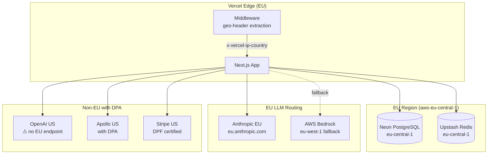
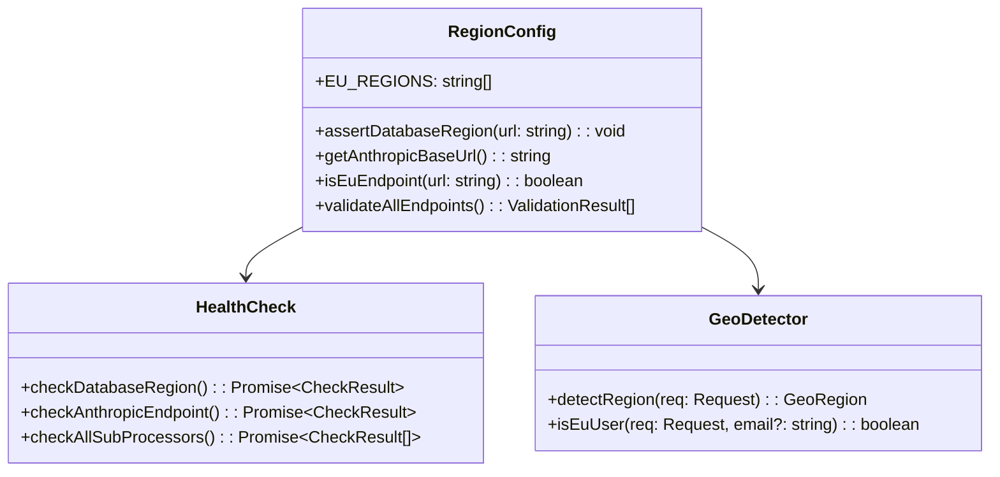
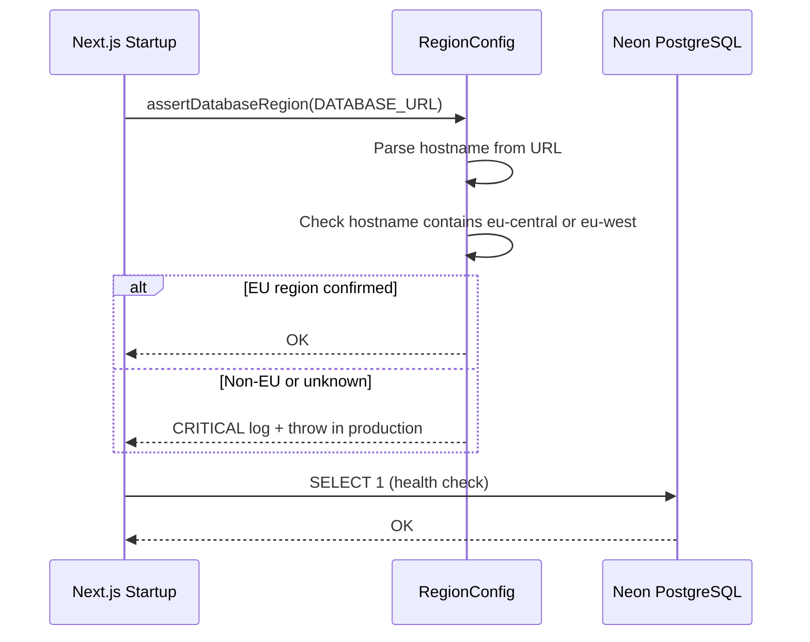
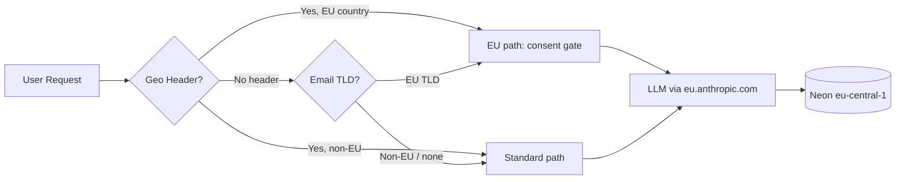

# FINDING-004 -- Design: EU Region Pinning

## System context

Elevay's backend runs on Vercel (Next.js), connects to Neon (PostgreSQL),
calls Anthropic/OpenAI for LLM inference, uses Resend for transactional email,
and Apollo for enrichment. The privacy page claims EU hosting that does not
match the actual deployment.

## Architecture overview



## Component design

### 1. EU region config module (`lib/region-config.ts`)

Single source of truth for all region-sensitive configuration.



### 2. Anthropic EU routing

The `@ai-sdk/anthropic` SDK accepts a `baseURL` option. All call sites that
create an Anthropic client will be updated to use a centralized factory:

```typescript
// lib/llm/anthropic-eu.ts
import { createAnthropic } from "@ai-sdk/anthropic";

export function getAnthropicClient() {
  return createAnthropic({
    baseURL: process.env.ANTHROPIC_BASE_URL || "https://eu.anthropic.com",
    apiKey: process.env.ANTHROPIC_API_KEY,
  });
}
```

Every file currently importing `{ anthropic } from "@ai-sdk/anthropic"`
directly (83+ files) will switch to this factory.

### 3. Database region assertion



The hostname of Neon EU projects contains the region slug
(e.g., `ep-something.eu-central-1.aws.neon.tech`). The assertion parses
this.

### 4. Geo-detection upgrade

Replace the email-TLD-only heuristic in the exposure route:

| Priority | Signal                      | Source                    |
|----------|-----------------------------|---------------------------|
| 1        | `x-vercel-ip-country`       | Vercel edge header        |
| 2        | `cf-ipcountry`              | Cloudflare (if proxied)   |
| 3        | `x-country-code`            | Custom proxy header       |
| 4        | Email TLD                   | Fallback only             |

The current code already reads headers 1-3 but treats email TLD as a
parallel check. The fix makes it strictly a fallback.

### 5. DPA manifest

```
/legal/dpas.json
{
  "subProcessors": [
    {
      "name": "Anthropic",
      "purpose": "LLM inference",
      "region": "EU (eu.anthropic.com)",
      "dpaStatus": "pending",
      "dpaUrl": null,
      "notes": "DPA available at anthropic.com/legal"
    },
    ...
  ],
  "lastUpdated": "2026-04-27"
}
```

The privacy page reads this manifest at build time and renders the
sub-processor table from it, ensuring the page can never drift from the
actual DPA state.

### 6. Privacy page update

Remove hardcoded sub-processor table. Import from `dpas.json`. Update
"Supabase (PostgreSQL)" to "Neon (PostgreSQL)" to match actual infra.

## Data flow



## Security considerations
- `ANTHROPIC_BASE_URL` must only accept `https://eu.anthropic.com` or
  Bedrock endpoints. Validate at startup to prevent SSRF via env injection.
- Database URL validation must not log the full connection string (contains
  password).
- DPA manifest must not be user-editable at runtime.

## Failure handling
- If Anthropic EU endpoint is down, DO NOT fall back to US endpoint (that
  would violate GDPR). Log critical error and return 503 to the user.
- If geo-header is missing in production, default to EU treatment
  (safe-by-default).
- Health-check failure in dev mode: warn but do not block startup.

## Migration path
1. Provision Neon project in eu-central-1 (or verify existing).
2. Update `DATABASE_URL` in all environments.
3. Deploy region config module + health checks.
4. Update Anthropic client factory across codebase.
5. Update privacy page to read from DPA manifest.
6. Run full regression suite.
