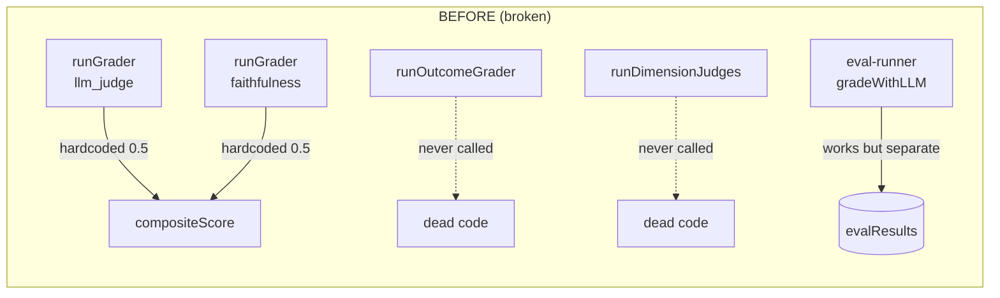
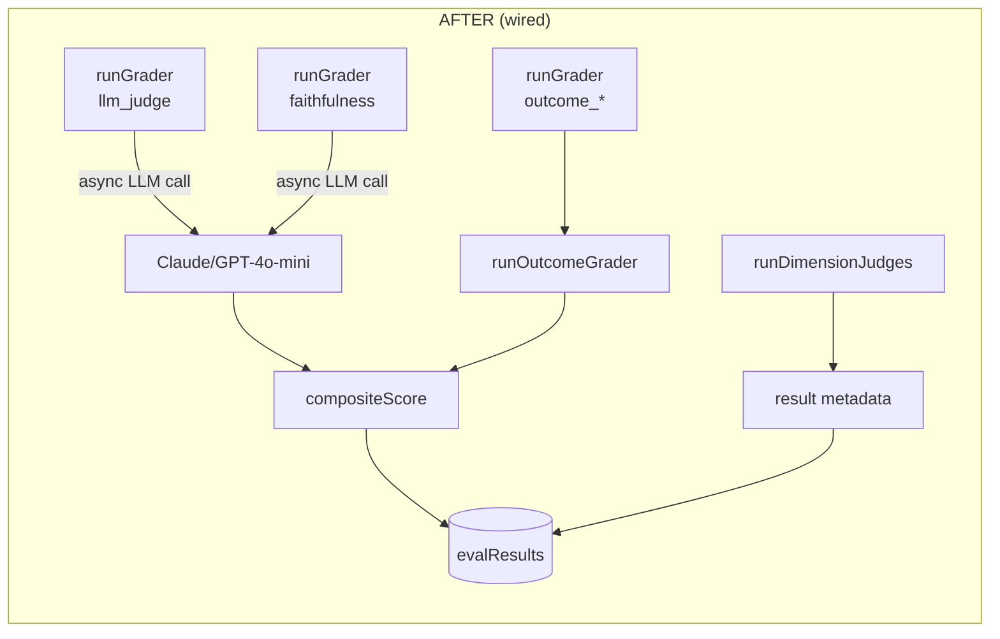
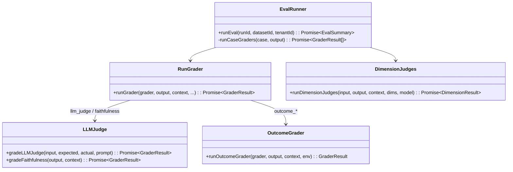
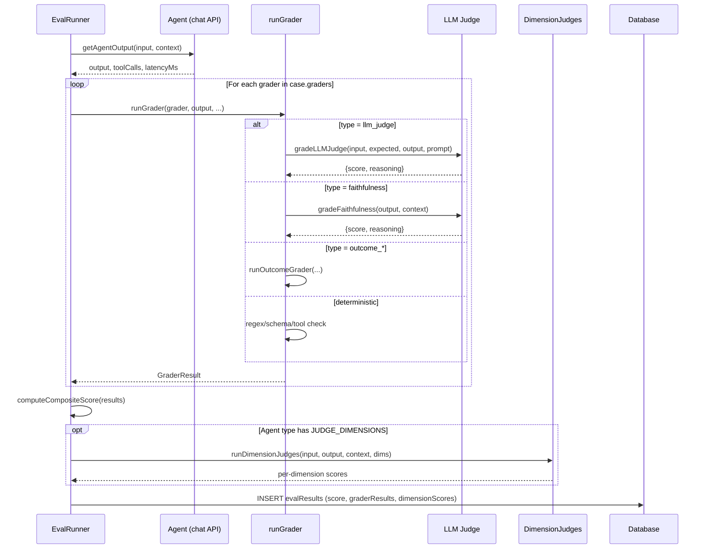

# FINDING-005 -- Design: LLM Judge Grader Implementation

## System context

The eval framework has two layers:
1. **`agent-evals.ts`** -- defines grader types, per-agent eval configs, and
   the `runGrader()` function that scores individual graders.
2. **`eval-runner.ts`** -- orchestrates full eval runs: iterates cases, calls
   the agent, grades output via `gradeWithLLM()`, stores results.

The problem is that these two layers are disconnected for LLM-based grading.
`eval-runner.ts` has a working `gradeWithLLM()` but `agent-evals.ts` stubs
out its own `llm_judge`/`faithfulness` graders.

## Architecture: before and after





## Key design decision: make `runGrader` async

Currently `runGrader()` is synchronous. LLM calls are inherently async.
Two options:

| Option | Pros | Cons |
|--------|------|------|
| A. Make `runGrader` async | Clean, single code path | Breaking change to all callers |
| B. Post-process LLM graders separately | No signature change | Two grading passes, complex |

**Decision: Option A.** `runGrader` becomes `async`. The function is only
called from `computeCompositeScore` which is only called from within the eval
pipeline -- a controlled surface area. The eval pipeline is already async.

## Component design



## Data flow for a single eval case



## LLM judge implementation detail

### `gradeLLMJudge`

```typescript
async function gradeLLMJudge(
  input: string,
  expectedOutput: string,
  actualOutput: string,
  judgePrompt: string | undefined,
  judgeModel: string,
): Promise<GraderResult>
```

- Uses the agent config's `llmJudgePrompt` if provided; otherwise a generic
  rubric.
- Truncates `actualOutput` to 2000 chars to control cost.
- Extracts score via `SCORE: X.XX` pattern (same as existing `gradeWithLLM`).
- On API failure: returns `{ passed: false, score: 0.0, detail: "LLM judge
  error: ..." }`.

### `gradeFaithfulness`

Dedicated prompt measuring groundedness:

```
You are a faithfulness evaluator. Given the CONTEXT and the AGENT OUTPUT,
score how grounded the output is in the provided context.

0.0 = completely hallucinated, no basis in context
0.5 = partially grounded, some claims unsupported
1.0 = fully grounded, every claim traceable to context

<context>...</context>
<output>...</output>

SCORE: X.XX
```

### Model selection for judges

- Primary: `gpt-4o-mini` (cheap, fast, good for grading)
- Fallback: `claude-haiku-4-5-20251001` via EU Anthropic client
- Never use the same model that generated the output (cross-model principle)

## Cost impact

| Grader type    | Calls per case | ~tokens/call | ~cost/call  |
|----------------|----------------|--------------|-------------|
| llm_judge      | 1              | ~800         | $0.0002     |
| faithfulness   | 1              | ~600         | $0.00015    |
| dimension (5x) | 5              | ~500 each    | $0.00075    |

For a 50-case eval run with all graders active: ~$0.05 total.

## Failure handling

- LLM API timeout: 10s per grader call, return score 0.0 on timeout.
- LLM returns unparseable response: score 0.0, detail includes raw response
  snippet.
- All LLM graders fail: composite score computed from deterministic graders
  only, with a warning flag in the eval result.
- Rate limiting: eval runner already processes cases sequentially; no
  parallel LLM calls needed per case.

## Backward compatibility

- `runGrader` signature changes from sync to async. All callers must be
  updated.
- `computeCompositeScore` remains sync (operates on resolved GraderResults).
- Existing eval results in the database are unaffected (they store the final
  score, not intermediate grader results).
- Eval results will now have meaningful llm_judge scores where they
  previously had 0.5 -- this may cause some evals to "fail" that previously
  "passed" due to inflated scores. This is correct behavior.
